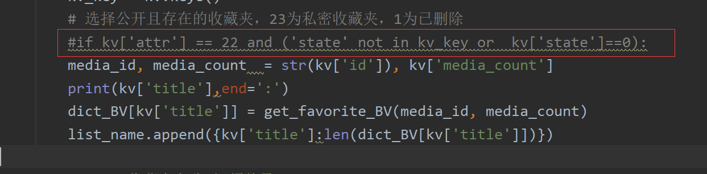

# 功能

+ 
+ 下载B站用户收藏夹中的视频

# 用法示例

1. **获取up_mid**

   - 

   - 设置up_mid
   - 

2. **获取cookie**

   - 浏览器中按F12
   - 
   - 设置cookie

3. **下载**
   - 选择下载其中一个收藏夹的视频
     
   - 下载所有收藏夹的视频
   - 
   - 如果是下载自己的收藏夹，则可以注释筛选条件
     

4. **运行效果**


# 代码

```python
import sys

import requests
import json

import you_get
#{'count': 13,
# 'list':
#       [{'id': 224965212, 'fid': 2249652, 'mid': 379313012, 'attr': 1,
#           'title': '默认收藏夹', 'fav_state': 0, 'media_count': 163},
dict_name = {}
list_name = []
# {
#     "默认收藏夹":[
#         {
#             "upper":{
#                 "mid":647613877,
#                 "name":"考研阿超",
#                 "face":""
#             },
#             "bv_id":"BV1Uh411X7aZ"
#         },
dict_BV = {}

cookie = ''

def get_favorite_lsit(up_mid):
    global dict_name
    url = 'https://api.bilibili.com/x/v3/fav/folder/created/list-all?'
    param = {
        'up_mid':up_mid,
        'jsonp':'jsonp'
    }

    header = {
        'user-agent': 'Mozilla/5.0 (Windows NT 10.0; Win64; x64) AppleWebKit/537.36 (KHTML, like Gecko) Chrome/86.0.4240.111 Safari/537.36',
        'dnt':'1',
        'origin':'https://space.bilibili.com',
        'referer':'https://space.bilibili.com/',
        'authority':'api.bilibili.com',
        'cookie':cookie
    }
    response = requests.get(url=url, params= param, headers=header)

    dict_ = response.json()
    #print(dict_)
    dict_name['count'] = dict_['data']['count']
    dict_name['list'] = dict_['data']['list']
    #print(dict_name)

def get_favorite_collected(up_mid):
    pn = 1
    url = 'https://api.bilibili.com/x/v3/fav/folder/collected/list?'
    param = {
        'up_mid':up_mid,
        'jsonp':'jsonp',
        'pn':'1',
        'ps': '20'
    }

    header = {
        'user-agent': 'Mozilla/5.0 (Windows NT 10.0; Win64; x64) AppleWebKit/537.36 (KHTML, like Gecko) Chrome/86.0.4240.111 Safari/537.36',
        'cookie':cookie
    }
    response = requests.get(url=url, params= param, headers=header)

    dict_ = response.json()
    print(dict_)
    dict_name['count'] += dict_['data']['count']
    dict_name['list'].extend(dict_['data']['list'])
    if dict_['data']['count'] > 20:
        pn = dict_['data']['count']//20
        if dict_['data']['count']%20!=0:
            pn+=1
    for i in range(2,pn+1):
        param = {
            'up_mid': up_mid,
            'jsonp': 'jsonp',
            'pn':str(i),
            'ps': '20'
        }
        response = requests.get(url=url, params=param, headers=header)

        dict_ = response.json()
        dict_name['list'].extend(dict_['data']['list'])
    #print(dict_name)
    #print(len(dict_name['list']))


def get_favorite_BV(media_id, media_count):
    list_BV = []
    url = 'https://api.bilibili.com/x/v3/fav/resource/list?'
    n = media_count//20
    if media_count%20!=0:
        n+=1
    for i in range(1,n+1):
        param = {
            'media_id':media_id,
            'pn':str(i),
            'ps':'20',
            'keyword':'',
            'order':'mtime',
            'type':'0',
            'tid':'0',
            'jsonp':'jsonp',
        }

        header = {
             'user-agent':'Mozilla/5.0 (Windows NT 10.0; Win64; x64) AppleWebKit/537.36 (KHTML, like Gecko) Chrome/86.0.4240.111 Safari/537.36',
            'cookie':cookie
        }

        response = requests.get(headers=header, params= param, url=url)

        dict_js = response.json()
        for i in dict_js['data']['medias']:
            d = {}
            d['upper'] = i['upper']
            d['bv_id'] = i['bv_id']
            d['title'] = i['title']
            list_BV.append(d)

    print(len(list_BV))
    return list_BV
    # with open('bilibili.json', 'w', encoding='utf-8') as fp:
    #     json.dump(dict_js,fp=fp,ensure_ascii=False)
    # print('over')


def you_get_down(url,path):
    sys.argv = ['you-get', '-o', path, url]
    you_get.main()

if __name__ == "__main__":
    #设置cookie
    cookie = 'uuid=16DDA4DB-448F-6A59-DAE7-3BCFF47B670276576infoc; buvid3=6548F306-CB60-42C3-A464-27E006B121A9155841infoc; DedeUserID=379313012; DedeUserID__ckMd5=fd12056a12ef95f6; SESSDATA=7b677b9c%2C1604886804%2Ce3f2d*51; bili_jct=3d5d0f1ad9d0edf321b406623635a195; LIVE_BUVID=AUTO6015902898424784; sid=iiyfb0me; dy_spec_agreed=1; blackside_state=1; CURRENT_FNVAL=80; CURRENT_QUALITY=112; flash_player_gray=false; PVID=1; rpdid=|(um~JJl~u||0J\'uY|JllkRRl; bp_t_offset_379313012=449941160478428731; bp_video_offset_379313012=449987382919913387; bfe_id=393becc67cde8e85697ff111d724b3c8'
    #设置up_mid
    up_mid = '409409995'
	# 获取所有收藏夹
        # 获取TA的创建
    get_favorite_lsit(up_mid)
        # 获取TA的收藏
    get_favorite_collected(up_mid)

    #获取所有收藏夹中视频的BV号
    for kv in dict_name['list']:
        #print(kv)
        kv_key = kv.keys()
        # 选择公开且存在的收藏夹，23为私密收藏夹，1为已删除
        if kv['attr'] == 22 and ('state' not in kv_key or  kv['state']==0):
            media_id, media_count  = str(kv['id']), kv['media_count']
            print(kv['title'],end=':')
            dict_BV[kv['title']] = get_favorite_BV(media_id, media_count)
            list_name.append({kv['title']:len(dict_BV[kv['title']])})

    with open('收藏夹名称&视频数量.txt', 'w', encoding='utf-8') as fp:
        json.dump(list_name, fp=fp, ensure_ascii=False)
    with open('BVid.json', 'w', encoding='utf-8') as fp:
        json.dump(dict_BV,fp=fp,ensure_ascii=False)

    #用you-get下载

    for key,value in dict_BV.items():
         #选择一个收藏夹
        if key == '选择一个收藏夹':
            for i in value:
                # 视频网站的地址
                you_url = 'https://www.bilibili.com/video/'+i['bv_id']
                # 视频输出的位置
                path = './'
                you_get_down(you_url,path)
                print(i['title'])
```

