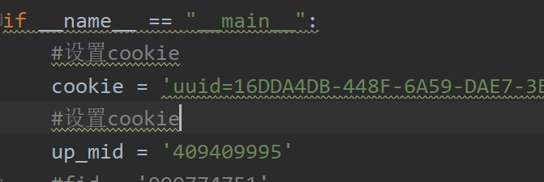
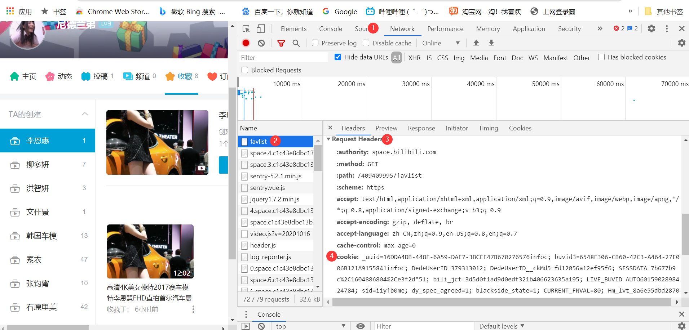
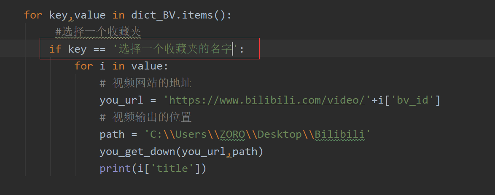
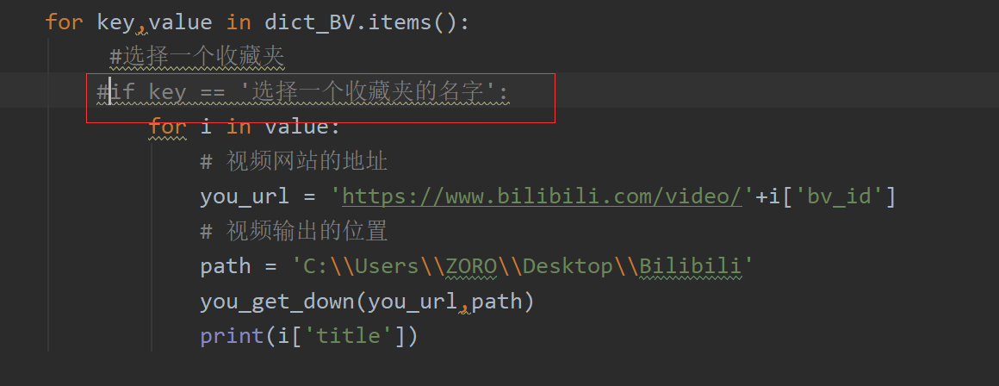
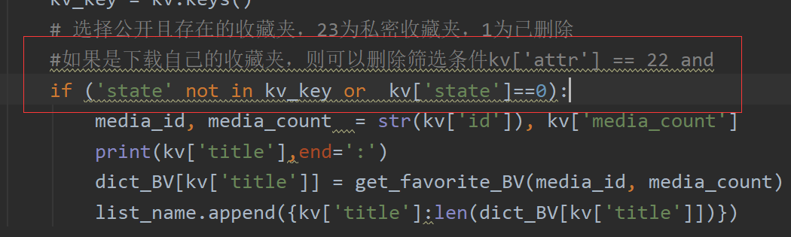

# 功能

1. 下载B站用户收藏夹中的视频

   <iframe src="//player.bilibili.com/player.html?aid=712544106&bvid=BV1ED4y197LX&cid=249642338&high_quality=1" width="900" height="600" ></iframe>

# 用法示例

1. **获取up_mid**

   - 

   - 设置up_mid
   - 

2. **获取cookie**

   - 浏览器中按F12
   - 
   - 设置cookie

3. **获取UA**

   - 

     ​	

   - 设置UA

1. **下载**
   - 选择下载其中一个收藏夹的视频
     
   - 下载所有收藏夹的视频
   - 
   - 如果是下载自己的收藏夹，则可以删除筛选条件kv['attr'] == 22
     
2. **运行效果**


# 代码

```python
import sys

import requests
import json
import you_get

dict_name = {}
list_name = []
dict_BV = {}

UA = ''
cookie = ''

def get_favorite_lsit(up_mid):
    global dict_name
    url = 'https://api.bilibili.com/x/v3/fav/folder/created/list-all?'
    param = {
        'up_mid':up_mid,
        'jsonp':'jsonp'
    }

    header = {
        'user-agent': UA,
        'dnt':'1',
        'origin':'https://space.bilibili.com',
        'referer':'https://space.bilibili.com/',
        'authority':'api.bilibili.com',
        'cookie':cookie
    }
    response = requests.get(url=url, params= param, headers=header)

    dict_ = response.json()
    dict_name['count'] = dict_['data']['count']
    dict_name['list'] = dict_['data']['list']


def get_favorite_collected(up_mid):
    pn = 1
    url = 'https://api.bilibili.com/x/v3/fav/folder/collected/list?'
    param = {
        'up_mid':up_mid,
        'jsonp':'jsonp',
        'pn':'1',
        'ps': '20'
    }

    header = {
        'user-agent': UA,
        'cookie':cookie
    }
    response = requests.get(url=url, params= param, headers=header)

    dict_ = response.json()
    print(dict_)
    dict_name['count'] += dict_['data']['count']
    dict_name['list'].extend(dict_['data']['list'])
    if dict_['data']['count'] > 20:
        pn = dict_['data']['count']//20
        if dict_['data']['count']%20!=0:
            pn+=1
    for i in range(2,pn+1):
        param = {
            'up_mid': up_mid,
            'jsonp': 'jsonp',
            'pn':str(i),
            'ps': '20'
        }
        response = requests.get(url=url, params=param, headers=header)

        dict_ = response.json()
        dict_name['list'].extend(dict_['data']['list'])


def get_favorite_BV(media_id, media_count):
    list_BV = []
    url = 'https://api.bilibili.com/x/v3/fav/resource/list?'
    n = media_count//20
    if media_count%20!=0:
        n+=1
    for i in range(1,n+1):
        param = {
            'media_id':media_id,
            'pn':str(i),
            'ps':'20',
            'keyword':'',
            'order':'mtime',
            'type':'0',
            'tid':'0',
            'jsonp':'jsonp',
        }

        header = {
             'user-agent':UA,
            'cookie':cookie
        }

        response = requests.get(headers=header, params= param, url=url)

        dict_js = response.json()
        for i in dict_js['data']['medias']:
            d = {}
            d['upper'] = i['upper']
            d['bv_id'] = i['bv_id']
            d['title'] = i['title']
            list_BV.append(d)

    print(len(list_BV))
    return list_BV


def you_get_down(url,path):
    sys.argv = ['you-get', '-o', path, url]
    you_get.main()

if __name__ == "__main__":
    #设置UA
    UA = ''
    #设置cookie
    cookie = ''
    #设置up_mid
    up_mid = '409409995'
	# 获取所有收藏夹
        # 获取TA的创建
    get_favorite_lsit(up_mid)
        # 获取TA的收藏
    get_favorite_collected(up_mid)

    #获取所有收藏夹中视频的BV号
    for kv in dict_name['list']:
        #print(kv)
        kv_key = kv.keys()
        # 选择公开且存在的收藏夹，23为私密收藏夹，1为已删除
        #如果是下载自己的收藏夹，则可以删除筛选条件kv['attr'] == 22 and
        if kv['attr'] == 22 and ('state' not in kv_key or  kv['state']==0):
            media_id, media_count  = str(kv['id']), kv['media_count']
            print(kv['title'],end=':')
            dict_BV[kv['title']] = get_favorite_BV(media_id, media_count)
            list_name.append({kv['title']:len(dict_BV[kv['title']])})

    with open('收藏夹名称&视频数量.txt', 'w', encoding='utf-8') as fp:
        json.dump(list_name, fp=fp, ensure_ascii=False)
    with open('BVid.json', 'w', encoding='utf-8') as fp:
        json.dump(dict_BV,fp=fp,ensure_ascii=False)

    #用you-get下载

    for key,value in dict_BV.items():
         #选择一个收藏夹
        if key == '选择一个收藏夹':
            for i in value:
                # 视频网站的地址
                you_url = 'https://www.bilibili.com/video/'+i['bv_id']
                # 视频输出的位置
                path = './'+key
                you_get_down(you_url,path)
                print(i['title'])
```

